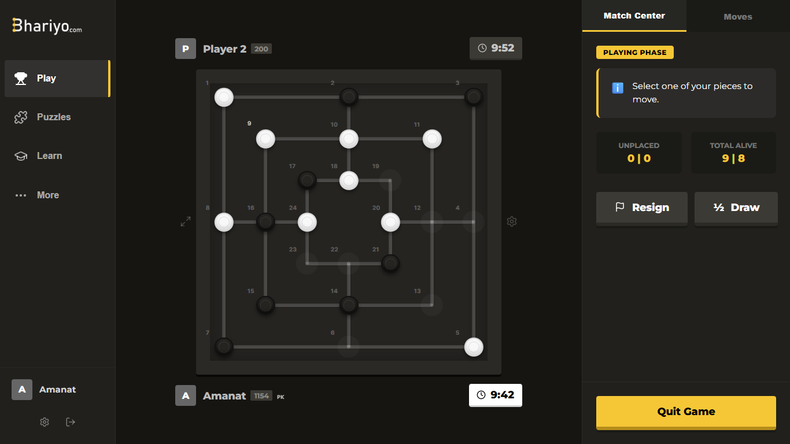

# 🏆 Bhariyo (بھریو)

Bhariyo is a modern, AI-powered digital implementation of the ancient board game **Nine Men's Morris**. Built with a focus on high-performance AI, real-time multiplayer connectivity, and a premium user experience, Bhariyo brings a centuries-old tradition into the modern era.



## 🌟 Key Features

### 🤖 Advanced Artificial Intelligence
- **Multiple Difficulty Tiers**: Play against bots ranging from `NOOB` to `EXPERT`.
- **Hybrid AI Engine**: Combines classic **Minimax with Alpha-Beta Pruning** and **Iterative Deepening** with modern **Monte Carlo Tree Search (MCTS)**.
- **Neural Network Evaluation**: Utilizes **Graph Convolutional Networks (GCN)** and **ResNet** architectures (via TensorFlow.js and ONNX) to evaluate board positions.
- **Adaptive Learning**: Intelligent bots that adjust their strategy based on learned weights stored in the cloud.
- **Offloaded Computation**: All AI logic runs in **Web Workers** to ensure a lag-free 60FPS UI.

### ⚔️ Real-time Multiplayer
- **Powered by Supabase**: Seamless matchmaking and real-time game synchronization.
- **Voice Chat**: Integrated **WebRTC Voice Chat** allowing players to communicate during matches.
- **Global Leaderboard**: Compete for ELO points and track your rank globally.
- **Match History**: Detailed game logs and move-by-move replays.

### 🎓 Learning & Mastery
- **Puzzle Mode**: Challenge yourself with hand-crafted Bhariyo puzzles.
- **Learn View**: Interactive tutorials to master the rules and strategies of Nine Men's Morris.
- **Focus Mode**: A distraction-free UI designed for deep concentration.

---

## 🛠️ Technical Stack

### Frontend
- **Framework**: [React 19](https://react.dev/) + [Vite](https://vitejs.dev/)
- **Styling**: Vanilla CSS (Custom Design System)
- **Icons**: [Lucide React](https://lucide.dev/)
- **State Management**: React Context & Hooks

### Backend & Infrastructure
- **Database/Realtime**: [Supabase](https://supabase.com/)
- **Backend API**: Node.js + Express (Deployed on Vercel)
- **Voice Communication**: Simple-Peer (WebRTC)

### Machine Learning
- **TensorFlow.js**: Running GCN and ResNet models in the browser.
- **ONNX Runtime Web**: High-performance model inference.
- **MCTS**: Custom Monte Carlo Tree Search implementation for strategic depth.

---

## 🚀 Getting Started

### Prerequisites
- Node.js (v18 or higher)
- npm or yarn

### Installation
1. Clone the repository:
   ```bash
   git clone https://github.com/AmanatAliPanhwer/Bhariyo.git
   cd Bhariyo
   ```

2. Install dependencies for both frontend and backend:
   ```bash
   # Frontend
   npm install

   # Backend
   cd server
   npm install
   ```

3. Configure environment variables:
   Create a `.env` file in the root and `/server` directories with your Supabase credentials.

4. Run the development server:
   ```bash
   # From the root directory
   npm run dev
   ```

---

## 📜 Rules of Bhariyo (Nine Men's Morris)

1. **Phase 1: Placing**: Players take turns placing 9 pieces on the 24 available nodes.
2. **Phase 2: Moving**: Once all pieces are placed, players move pieces to adjacent nodes.
3. **Phase 3: Flying**: When a player is reduced to 3 pieces, they can "fly" (move to any vacant node).
4. **Mills**: Forming a line of 3 pieces (a "Mill") allows you to remove one of your opponent's pieces.
5. **Winning**: You win by reducing your opponent to 2 pieces or by blocking all their legal moves.

---

## 🤝 Contributing

Contributions are welcome! Whether it's improving the AI, adding new puzzle sets, or refining the UI, feel free to open a Pull Request.

## 📄 License

This project is licensed under the MIT License - see the LICENSE file for details.

---
*Created with ❤️ by Amanat Ali Panhwer*
